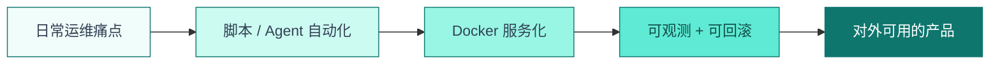

<!--
  GitHub Profile README · aiqinghaiwork163
  简洁现代 · Homelab / 运维 / 自动化
  Profile 页展示在 github.com/用户名，本地 assets 必须用 raw 绝对路径
-->

<div align="center">

<!-- Banner -->


<br/>


<br/>

<p>
  
  
  
  
</p>

**9 年 IT 运维** · 批量部署 · 网络工程 · Docker / NAS · 脚本自动化  
把基础设施当成产品来做 —— 稳定、可复现、可观测。


</div>

## 👋 About Me

<table>
<tr>
<td width="55%" valign="top">

```text
┌─ profile ─────────────────────────────────────────────┐
│  Focus    : Homelab · DevOps · 全栈运维 · 自动化        │
│  Stack    : Linux / Docker / Python / Network / NAS    │
│  Goal     : 持续工程化日常工作流                          │
│  Contact  : aiqinghaiwork@163.com                      │
└───────────────────────────────────────────────────────┘
```

- 🔭 日常在折腾 **Docker 集群、网盘检索、媒体服务、Agent 自动化**
- 🌱 持续学习 **Java 后端 / 系统设计 / 计算机基础**
- 🛠️ 专长 **MDT/WDS/PE 批量部署、AP/AC 网络、OA/MES/ERP 企业系统**
- 💡 偏好 **简洁现代** 的工程风格：可维护 > 花哨

</td>
<td width="45%" valign="top" align="center">


</td>
</tr>
</table>

---

## 🛠 Tech Stack

<p align="center">
  
</p>

<table>
<tr>
<td align="center" width="20%">
  <strong>🖥 系统与部署</strong><br/>
  <sub>Windows / Linux / macOS<br/>MDT / WDS / PE<br/>批量装机与镜像</sub>
</td>
<td align="center" width="20%">
  <strong>📦 容器与存储</strong><br/>
  <sub>Docker Compose · NAS<br/>反向代理<br/>Cloudflare Tunnel</sub>
</td>
<td align="center" width="20%">
  <strong>🌐 网络工程</strong><br/>
  <sub>AP / AC · 路由交换<br/>内网服务编排<br/>故障排查</sub>
</td>
<td align="center" width="20%">
  <strong>⚡ 自动化</strong><br/>
  <sub>Python / Shell / BAT<br/>定时任务<br/>Agent 工作流</sub>
</td>
<td align="center" width="20%">
  <strong>🚀 应用方向</strong><br/>
  <sub>资源检索 · 媒体站<br/>导航门户<br/>运维面板</sub>
</td>
</tr>
</table>

---

## ⭐ Featured Work

<table>
<tr>
<td width="50%" valign="top">

### 🔍 [resource_web](https://github.com/aiqinghaiwork163/resource_web)


**网盘资源浏览器** — 聚合检索与资源管理后台，面向日常「找片 / 找资源」场景的自托管方案。

</td>
<td width="50%" valign="top">

### 🗂 [pansou](https://github.com/aiqinghaiwork163/pansou)


**盘搜前端** — 多网盘聚合搜索界面，对接自建检索 API，轻量可部署。

</td>
</tr>
<tr>
<td width="50%" valign="top">

### 🏠 Homelab 导航 & 服务矩阵


Service Hub 导航、媒体站、库存系统、TG 自动化……  
把家里的小主机集群做成「一个可用的产品面」。

</td>
<td width="50%" valign="top">

### 🔧 开源关注


影视聚合、网盘搜索、代理与签到工具等方向的二次开发与自托管实践。

</td>
</tr>
</table>

<p align="center">
  <a href="https://github.com/aiqinghaiwork163?tab=repositories">
    
  </a>
</p>

---

## 📊 GitHub Pulse

<div align="center">


<br/>


<br/>

<!-- Snake animation -->
<picture>
  <source media="(prefers-color-scheme: dark)" srcset="https://raw.githubusercontent.com/aiqinghaiwork163/aiqinghaiwork163/main/assets/github-contribution-grid-snake-dark.svg">
  <source media="(prefers-color-scheme: light)" srcset="https://raw.githubusercontent.com/aiqinghaiwork163/aiqinghaiwork163/main/assets/github-contribution-grid-snake.svg">
  
</picture>

</div>

---

## 🔨 Currently Building



<table>
<tr>
<td width="25%" align="center">🔨<br/><strong>Homelab</strong><br/><sub>服务编排与版本化回滚</sub></td>
<td width="25%" align="center">🤖<br/><strong>Agent</strong><br/><sub>编码 / 运维 / 消息通道</sub></td>
<td width="25%" align="center">📦<br/><strong>网盘检索</strong><br/><sub>资源站体验打磨</sub></td>
<td width="25%" align="center">📚<br/><strong>后端工程</strong><br/><sub>Java 与系统设计补强</sub></td>
</tr>
</table>

---

## 📬 Connect

<div align="center">

<p>
  <a href="mailto:aiqinghaiwork@163.com">
    
  </a>
  <a href="https://github.com/aiqinghaiwork163">
    
  </a>
</p>

**Thanks for stopping by.**  
如果你也在搭 Homelab / 做运维自动化，欢迎交流 ⭐


<br/>


</div>
